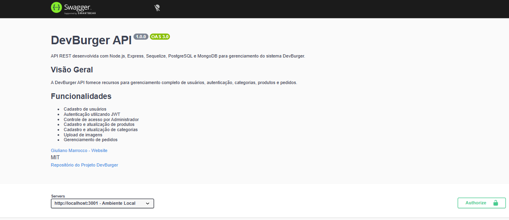
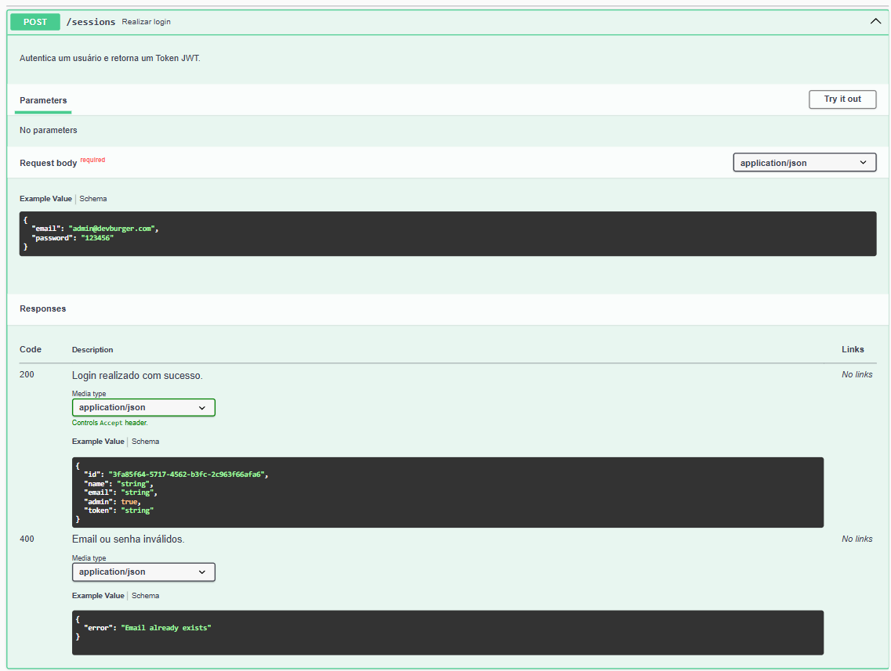
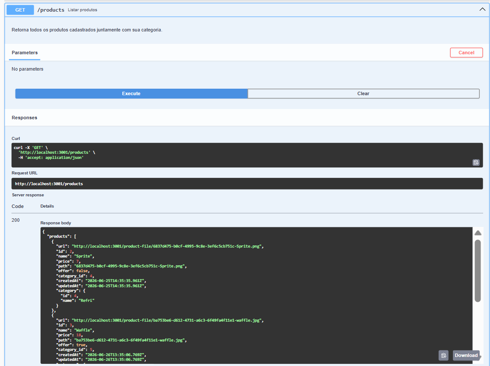
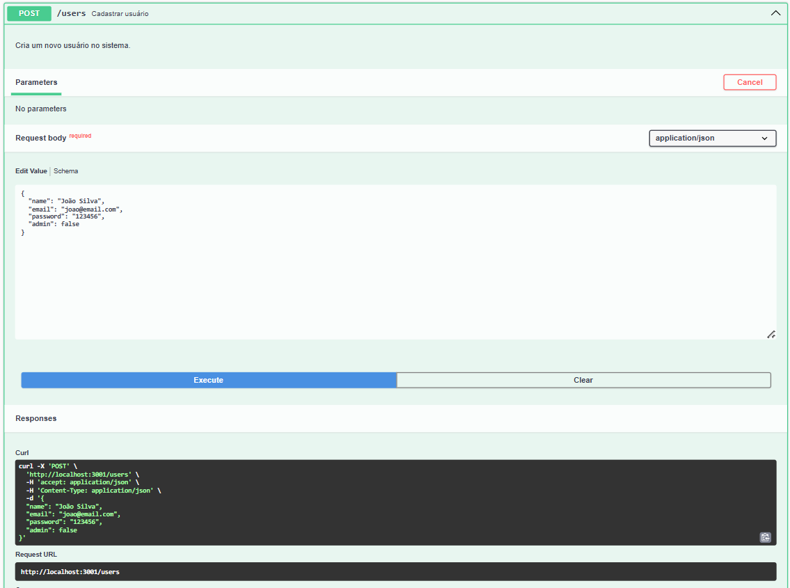

# 🍔 DevBurger API

<div align="center">

# API REST para Sistema de Delivery

Uma API REST completa desenvolvida com **Node.js**, **Express**, **PostgreSQL** e **MongoDB**, responsável pelo gerenciamento de usuários, autenticação, produtos, categorias e pedidos de uma aplicação de delivery.

Documentada com **Swagger (OpenAPI)** e construída utilizando boas práticas de arquitetura, autenticação JWT e organização em camadas.

<br>


</div>

---

# 📖 Sobre o Projeto

A **DevBurger API** é o backend de uma plataforma de delivery desenvolvida durante minha transição de carreira para o desenvolvimento Full Stack.

O projeto foi criado para consolidar conhecimentos em desenvolvimento de APIs REST utilizando Node.js, autenticação JWT, integração entre bancos de dados relacionais e NoSQL, upload de imagens, documentação interativa com Swagger e boas práticas de arquitetura.

Além das funcionalidades de negócio, o projeto prioriza organização de código, escalabilidade e facilidade de manutenção.

---

# 🎥 Demonstração

<p align="center">
    
</p>

---

# 📸 Screenshots

## 🏠 Página Inicial da Documentação

<p align="center">
    
</p>

---

## 🔐 Autenticação JWT

<p align="center">
    
</p>

---

## 🍔 Endpoint de Produtos

<p align="center">
    
</p>

---

## 👤 Endpoint de Usuários

<p align="center">
    
</p>

---

# 📑 Índice

- Sobre o Projeto
- Demonstração
- Screenshots
- Funcionalidades
- Diferenciais
- Tecnologias
- Arquitetura
- Estrutura do Projeto
- Instalação
- Documentação Swagger
- Fluxo de Autenticação
- Endpoints
- Exemplos
- Boas Práticas
- Roadmap
- Autor
- Licença

---

# 🚀 Funcionalidades

- ✅ Cadastro de usuários
- ✅ Login com autenticação JWT
- ✅ Controle de acesso para administradores
- ✅ CRUD completo de Produtos
- ✅ CRUD completo de Categorias
- ✅ Upload de imagens
- ✅ Criação de pedidos
- ✅ Atualização de status dos pedidos
- ✅ PostgreSQL para armazenamento relacional
- ✅ MongoDB para gerenciamento de pedidos
- ✅ Documentação interativa utilizando Swagger (OpenAPI)

---

# ⭐ Diferenciais

- Arquitetura em camadas (Controllers, Models, Middlewares e Config)
- API REST seguindo boas práticas
- Autenticação JWT
- Upload de arquivos com Multer
- Criptografia de senhas com bcrypt
- Validação de dados com Yup
- Documentação interativa com Swagger
- Integração entre PostgreSQL e MongoDB
- Docker para banco de dados
- Organização escalável
- Git e GitHub

---

# 🛠️ Tecnologias Utilizadas

| Tecnologia | Descrição |
|------------|-----------|
| Node.js | Ambiente de execução JavaScript |
| Express | Framework da API |
| PostgreSQL | Banco de dados relacional |
| Sequelize | ORM do PostgreSQL |
| MongoDB | Banco NoSQL |
| Mongoose | ODM do MongoDB |
| JWT | Autenticação |
| bcrypt | Criptografia de senhas |
| Multer | Upload de arquivos |
| Yup | Validação de dados |
| Swagger (OpenAPI) | Documentação interativa |
| Docker | Containerização |
| dotenv | Variáveis de ambiente |
| Git / GitHub | Versionamento |

---

# 🏗️ Arquitetura

```text
                 Cliente

                    │
                 HTTP/HTTPS

                    │

                Express Server

                    │

                 Routes

                    │

              Controllers

                    │

                 Models

          ┌─────────┴─────────┐

     PostgreSQL          MongoDB

 Usuários / Produtos      Pedidos
 Categorias
```

---

# 📁 Estrutura do Projeto

```text
src/
│
├── config/
│
├── controllers/
│
├── database/
│   ├── migrations/
│   └── models/
│
├── middlewares/
│
├── schemas/
│
├── services/
│
├── routes/
│
├── app.js
│
└── server.js
```
# ⚙️ Como Executar o Projeto

## 📋 Pré-requisitos

Antes de iniciar, certifique-se de possuir instalado:

- Node.js 20+
- pnpm (ou npm)
- Docker
- Git

---

## 📥 Clone o Repositório

```bash
git clone https://github.com/GiulianoMarrocco/dev-burger-backend.git
```

Entre na pasta do projeto:

```bash
cd dev-burger-backend
```

---

## 📦 Instale as Dependências

Utilizando pnpm:

```bash
pnpm install
```

ou com npm:

```bash
npm install
```

---

## ⚙️ Configure as Variáveis de Ambiente

Crie um arquivo `.env` na raiz do projeto.

Exemplo:

```env
APP_SECRET=sua-chave-jwt

DB_HOST=localhost
DB_PORT=5432
DB_USER=admin
DB_PASS=123456
DB_NAME=dev-burger-db

MONGO_URL=mongodb://localhost:27017/devburger
```

---

# 🐳 Docker

Para criar os bancos de dados localmente:

### PostgreSQL

```bash
docker run \
--name devburger-postgres \
-e POSTGRES_USER=admin \
-e POSTGRES_PASSWORD=123456 \
-e POSTGRES_DB=dev-burger-db \
-p 5432:5432 \
-d postgres
```

### MongoDB

```bash
docker run \
--name devburger-mongo \
-p 27017:27017 \
-d mongo
```

---

## 🗄️ Execute as Migrations

```bash
npx sequelize-cli db:migrate
```

---

## ▶️ Execute a Aplicação

```bash
pnpm dev
```

ou

```bash
npm run dev
```

A API ficará disponível em:

```text
http://localhost:3001
```

---

# 📖 Documentação Swagger

Após iniciar a aplicação, acesse:

```text
http://localhost:3001/api-docs
```

A documentação foi construída utilizando **Swagger (OpenAPI)**.

Ela permite:

- visualizar todos os endpoints;
- testar requisições diretamente no navegador;
- autenticar utilizando JWT;
- consultar exemplos de Request e Response;
- validar parâmetros e modelos de dados.

---

# 🔐 Fluxo de Autenticação

```text
POST /sessions
        │
        ▼
Retorna JWT
        │
        ▼
Authorize (Swagger)
        │
        ▼
Bearer Token
        │
        ▼
Rotas Protegidas
```

---

# 📚 Endpoints

## 👤 Usuários

| Método | Endpoint | Descrição |
|---------|----------|-----------|
| POST | `/users` | Cadastrar usuário |
| GET | `/users` | Listar usuários |
| PUT | `/users/:id` | Atualizar usuário |
| DELETE | `/users/:id` | Remover usuário |

---

## 🔐 Autenticação

| Método | Endpoint | Descrição |
|---------|----------|-----------|
| POST | `/sessions` | Login |

---

## 🍔 Produtos

| Método | Endpoint |
|---------|----------|
| GET | `/products` |
| POST | `/products` |
| PUT | `/products/:id` |
| DELETE | `/products/:id` |

---

## 🥤 Categorias

| Método | Endpoint |
|---------|----------|
| GET | `/categories` |
| POST | `/categories` |
| PUT | `/categories/:id` |
| DELETE | `/categories/:id` |

---

## 📦 Pedidos

| Método | Endpoint |
|---------|----------|
| GET | `/orders` |
| POST | `/orders` |
| PUT | `/orders/:id` |

---

# 📦 Exemplos

## Cadastro de Usuário

```json
{
  "name": "Henrique",
  "email": "henrique@email.com",
  "password": "123456"
}
```

---

## Login

```json
{
  "email": "henrique@email.com",
  "password": "123456"
}
```

Resposta:

```json
{
  "token": "eyJhbGciOiJIUzI1NiIs..."
}
```

---

## Cadastro de Produto

```json
{
  "name": "Hambúrguer Artesanal",
  "price": 39.90,
  "category_id": 2,
  "offer": false
}
```

---

## Criação de Pedido

```json
{
  "products": [
    {
      "id": 1,
      "quantity": 2
    },
    {
      "id": 4,
      "quantity": 1
    }
  ]
}
```

---# ✅ Boas Práticas Implementadas

Durante o desenvolvimento deste projeto foram aplicadas diversas boas práticas utilizadas em aplicações Node.js modernas.

### Arquitetura

- Arquitetura em camadas
- Separação entre Controllers, Models, Middlewares e Config
- Organização escalável
- Código reutilizável

### Segurança

- Autenticação JWT
- Criptografia de senhas com bcrypt
- Rotas protegidas
- Controle de acesso para administradores
- Variáveis de ambiente com dotenv

### Banco de Dados

- PostgreSQL para dados relacionais
- MongoDB para gerenciamento de pedidos
- Sequelize ORM
- Mongoose ODM
- Migrations versionadas

### Validação

- Yup para validação dos dados
- Tratamento de erros
- Respostas padronizadas

### Upload

- Upload de imagens utilizando Multer

### Documentação

- Swagger (OpenAPI)
- Exemplos de Request e Response
- Documentação navegável
- Autenticação integrada pelo botão **Authorize**

### Versionamento

- Git
- GitHub
- Commits organizados

---

# 📊 Organização da Aplicação

```text
                API REST

                 Express

                    │

        ┌───────────┼────────────┐

 Controllers   Middlewares    Config

        │

      Models

   ┌────┴─────┐

PostgreSQL  MongoDB

```

---

# 🎯 Objetivos do Projeto

Este projeto foi desenvolvido com foco em:

- Construção de APIs REST modernas
- Organização profissional de código
- Boas práticas de desenvolvimento
- Arquitetura escalável
- Segurança utilizando JWT
- Integração entre bancos SQL e NoSQL
- Documentação completa da API
- Portfólio profissional para vagas Full Stack

---

# 🗺️ Roadmap

## ✅ Concluído

- Cadastro de usuários
- Login com JWT
- Controle de administradores
- CRUD de Produtos
- CRUD de Categorias
- Cadastro de Pedidos
- Atualização de Status
- Upload de Imagens
- PostgreSQL
- MongoDB
- Swagger (OpenAPI)
- Docker
- Documentação da API

---

## 🚧 Próximas Melhorias

- Testes automatizados
- Deploy em produção
- Pipeline CI/CD
- Integração com Gateway de Pagamentos
- Cache com Redis
- Logs centralizados
- Monitoramento
- Testes de Integração

---

# 📈 Aprendizados

Durante o desenvolvimento deste projeto foi possível aprofundar conhecimentos em:

- Node.js
- Express
- PostgreSQL
- MongoDB
- Sequelize
- Mongoose
- JWT
- Docker
- Swagger
- Arquitetura em Camadas
- Upload de Arquivos
- APIs REST
- Git e GitHub

---

# 👨‍💻 Sobre o Projeto

A **DevBurger API** foi desenvolvida durante minha transição de carreira para a área de desenvolvimento Full Stack.

O objetivo foi criar uma aplicação completa para consolidar conhecimentos em APIs REST, autenticação JWT, upload de arquivos, integração entre bancos de dados relacionais e NoSQL, documentação com Swagger e organização em arquitetura em camadas.

Além das funcionalidades de negócio, o projeto prioriza qualidade de código, escalabilidade e facilidade de manutenção, seguindo práticas utilizadas em aplicações profissionais.

---

# 🤝 Contribuições

Contribuições são bem-vindas!

Caso encontre algum problema ou tenha sugestões de melhorias, fique à vontade para abrir uma **Issue** ou enviar um **Pull Request**.

---

# 👨‍💻 Autor

## Giuliano Marrocco

Desenvolvedor Full Stack em transição de carreira, com experiência anterior em Engenharia e Mercado Financeiro.

Atualmente focado em:

- JavaScript
- Node.js
- React
- PostgreSQL
- MongoDB
- APIs REST

### GitHub

https://github.com/GiulianoMarrocco

### LinkedIn

https://www.linkedin.com/in/giulianomarrocco

---

# ⭐ Apoie o Projeto

Se este projeto foi útil para você ou serviu como referência, considere deixar uma ⭐ no repositório.

Isso ajuda a divulgar o projeto e incentiva o desenvolvimento de novos conteúdos.

---

# 📄 Licença

Este projeto está licenciado sob a licença **MIT**.

Você pode utilizá-lo para fins de estudo e aprendizado.

---

<div align="center">

### 🍔 DevBurger API

Desenvolvido com ❤️ por **Giuliano Marrocco**

</div>
---